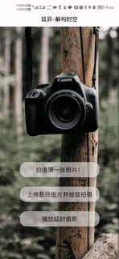
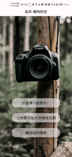
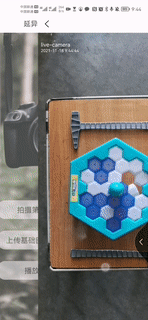
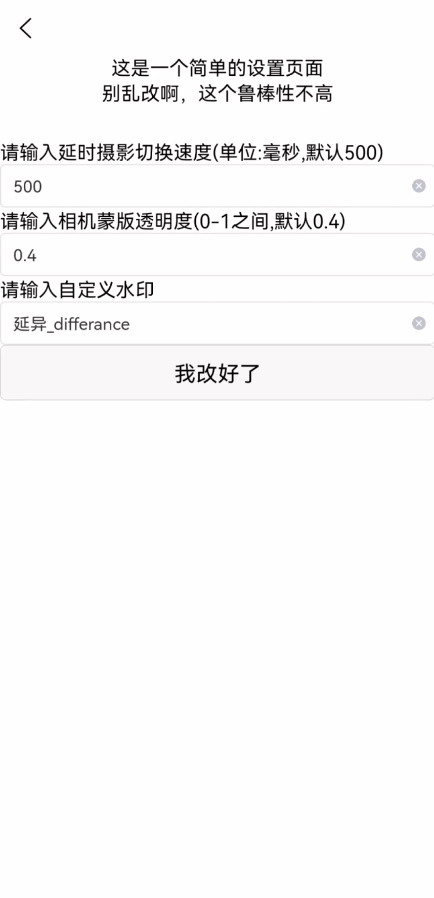

# 延异_differance

## 一、背景

传统延时摄影需要使用三脚架、滑轨等设备来实现对摄影设备的长时间固定来实现定点拍摄，其实这就对与只有手机的我们造成了很大的限制（我们总不能把自己的手机乃至自己长时间固定到一点上去吧……），于是我们提出了在相机上添加蒙版以实现每次摄影的位置校准的解决方案——**延异_differance**就应运而生了。

## 二、功能介绍

### 1. 拍摄第一张照片

本应用的相机部分使用[uni-app](https://gitee.com/link?target=https%3A%2F%2Funiapp.dcloud.io%2F) 框架的 [live-pusher 直播推流](https://gitee.com/link?target=https%3A%2F%2Funiapp.dcloud.io%2Fcomponent%2Flive-pusher) 组件实现拍照功能，部分代码借鉴 [live-camera](https://gitee.com/Yxiaohui/live-camera#%E4%B8%83%E6%9B%B4%E5%A4%9A) 实现

点击按钮，直接进拍摄界面，由于距离缩放会导致比例失调且难以定位，所以只默认支持一倍缩放，但是拍摄出的画面是与手机屏幕同样像素的，所拍即所得。

拍摄后的画面会加上时间和自定义的水印然后直接保存到系统相册。

### 2. 上传上次照片并继续拍摄

这个即是延异的核心功能，在系统相册中选择上次拍摄的图片，即可将图片半透明化以蒙版形式悬浮与相机上方，这样，在上次照片与相机画面重合时，按下快门，即可拍出与上次同样视角的照片。

### 3. 播放延时摄影

当我们拍摄了一定量的延时摄影作品时，在系统相册里按顺序选择摄影的照片（最大支持50张），即可在手机上播放拍摄出的摄影作品（循环播放，播放顺序与选择顺序相同）

### 4.参数设置

可以自定义的设置延时摄影切换速度、相机蒙版透明度和水印内容等参数。

## 三、安装

得益于HbuilderX这个强大的开发工具，在应用开发完成后可以直接一键云打包为APK，想直接体验的同学可以直接下载apk安装包，一键安装进行体验。

想要进行调试和修改的同学可以下载源代码文件，通过HbuilderX进行查看和运行。

## 四、更新日志
### 0.75 (2021.12.20)

1. 稍微美化了一下设置界面
2. 设置界面设置完成点击按钮可以返回
3. 增加了对自定义水印的支持
### 0.6 (2021.12.15)

1. 更换了更加专业的启动页
2. 加入设置菜单，可以自定义播放速度和蒙版透明度（点击右下角那块木头就能进入设置菜单）

### 0.41 (2021.12.14)

1. 进行了主界面的美化，更改了按钮样式与排版。

2. 加入了自定义图标与启动页
3. 打包为APK便于安装

### 0.3 (2021.12.8)

实现三个基础功能，发布基础版本
